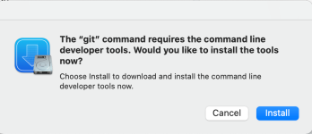
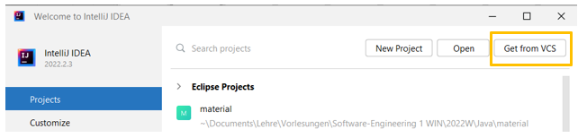
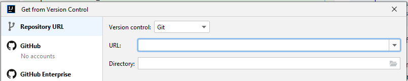
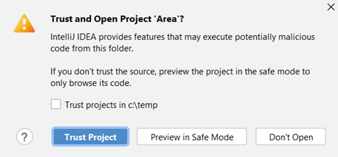
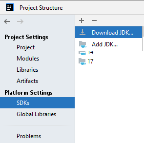
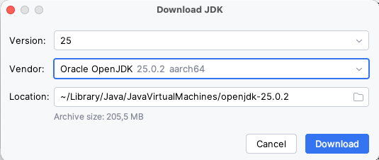
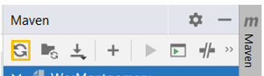

# EPR-WIN (Prof. Schneider/Prof. Eiglsperger), Blatt 1

Abgabetermin: 26.03.2026


## Präsenzaufgabe 1.1, Git und IntelliJ installieren

**Hinweis**: Die Installation der Tools auf Ihrem Rechner ist empfehlenswert,
aber freiwillig. Sie können auch auf den Laborrechnern arbeiten, wo alles
vorinstalliert ist.

Wir installieren nur Git und IntelliJ. Das OpenJDK können wir aus
IntelliJ heraus beziehen.

### Windows: Installation von Git

Git von der [Webseite](https://git-scm.com/downloads) herunterladen und
installieren.

Alternativ können Sie auch über den Microsoft Store den Paketmanager `winget`
installieren und dann einfach

```
winget install -e --id Git.Git
```

in der Kommandozeile ausführen (siehe Folie zum Thema Kommandozeile).
Über `winget` können Sie später weitere Software installieren, die Sie
für Ihr Studium brauchen, welche Sie unter <https://winget.run/> finden können
(inkl. Installationsbefehl).

### macOS: Installation von Git

Öffnen Sie eine Kommandozeile (siehe Vorlesungsfolie) und führen Sie den Befehl
`git` aus.

Sie sollten nun eine
Meldung `note: install requested for command line developer tools` erhalten und
es sollte sich ein Dialog öffnen:



Klicken Sie auf "Install".

Falls das nicht funktioniert, installieren Sie Git über
eine [der hier beschriebenen Methoden](https://git-scm.com/download/mac), am
besten über Homebrew.

### Linux: Installation von Git

Installieren Sie git mit dem Paketmanager Ihrer Distribution. Bei
Debian-basierten Distros (Debian, Ubuntu, Mint) geht das mit

```
sudo apt install git
```

### Alle Betriebsysteme: Git testen und konfigurieren

Öffnen Sie eine Kommandozeile und testen Sie mit

```text
git --version
```

dass Git installiert ist. Es sollte eine Ausgabe kommen, welche die Version
von Git anzeigt und keine Fehlermeldung.

Konfigurieren Sie Ihren Git-Namen und Ihre Mail-Adresse, indem Sie in der
Kommandozeile nacheinander folgende Befehle ausführen. Ersetzen Sie Mona Lisa
und die E-Mail-Adresse durch Ihren Namen und Ihre Adresse.

```
git config --global user.name "Mona Lisa"
git config --global user.email "mo123lis@htwg-konstanz.de"
```

#### SSH-Schlüssel erzeugen

Zum Einloggen beim HTWG Git Server müssen Sie ein *SSH-Schlüssel* erzeugen und im Git Server hinterlegen.
Sie erzeugen einen SSH-Schlüssel mit folgendem Befehl in der Kommandozeile:

```
ssh-keygen -t ed25519 -C "mo123lis@htwg-konstanz.de"
```

Sie werden beim Erzeugen nach einem *Speicherort* und einer *Passphrase* für den SSH-Schlüssel gefragt.
Bei der Frage für den Speicherort drücken Sie Enter (Standard: ~/.ssh/id_ed25519).
Die Verwendung einer Passphrase ist optional und wird für diese Vorlesung **nicht** empfohlen.
Wenn Sie trotzdem eine Passphrase verwenden, dann müssen Sie sich diese merken und am besten in einem Passwortmanager verwalten.
Wenn Sie nach der Passphrase gefragt werden, drücken Sie deswegen ebenfalls Enter.

Nach der Erzeugung lassen Sie sich den SSH-Schlüssel durch folgendes Kommando anzeigen:

```
cat ~/.ssh/id_ed25519.pub
```

#### SSH-Schlüssel in GitLab hinzufügen

1. Melden Sie sich bei **GitLab** an.
2. Wählen Sie in der linken Seitenleiste Ihr **Avatar**-Bild aus.
3. Wählen Sie **Profil bearbeiten**.
4. Wählen Sie in der linken Seitenleiste **SSH-Schlüssel**.
5. Wählen Sie **Neuen Schlüssel hinzufügen**.
6. Fügen Sie im Feld **Schlüssel** den Inhalt Ihres Public Keys ein.
    - Wenn Sie den Schlüssel manuell kopiert haben, stellen Sie sicher, dass Sie den **kompletten Schlüssel** kopieren.
    - Er beginnt mit `ssh-ed25519` und endet mit der von Ihnen bei der Schlüsselerzeugung eingegebenen E-Mail-Adresse.
7. Geben Sie im Feld **Titel** eine Beschreibung ein, z. B. *Work Laptop* oder *Home Workstation*.
8. *(Optional)* Wählen Sie den **Verwendungstyp** des Schlüssels.
    - Möglich sind **Authentifizierung**, **Signieren** oder **beides**.
    - Standard ist **Authentifizierung & Signieren**.
9. Standardmäßig ist ein Ablaufdatum hinterlegt. 
Wenn Sie vermeiden wollen, dass der Schlüssel ab dem Ablaufdatum nicht mehr gültig ist, dann entfernen Sie das Ablaufdatum.

#### Erste Verbindung mit GitLab über SSH

Führen Sie folgenden Befehl in der Kommandozeile aus:

```
ssh -T git@git.in.htwg-konstanz.de
```

Wenn Sie sich zum ersten Mal verbinden, sollten Sie die **Authentizität des GitLab-Hosts** überprüfen.  
Falls Sie eine Meldung wie diese sehen:

```
The authenticity of host ‘gitlab.example.com (35.231.145.151)’ can’t be established.
ECDSA key fingerprint is SHA256:HbW3g8zUjNSksFbqTiUWPWg2Bq1x8xdGUrliXFzSnUw.
Are you sure you want to continue connecting (yes/no)? yes
Warning: Permanently added ‘gitlab.example.com’ (ECDSA) to the list of known hosts.
```

Geben Sie `yes` ein und drücken Sie **Enter**.

Führen Sie anschließend den Befehl erneut aus:

```
ssh -T git@git.in.htwg-konstanz.de
```

Sie sollten dann eine Meldung wie diese erhalten:
```
Welcome to GitLab, @username!
```

### Installation von IntelliJ

Laden Sie IntelliJ von der [Webseite](https://www.jetbrains.com/idea/download/)
herunter und installieren Sie es.

## Präsenzaufgabe 1.2, Ordner-Struktur anlegen

Legen Sie eine für Ihr Studium sinnvolle Ordnerstruktur auf Ihrem Rechner (oder
auf dem Z-Laufwerk des Laborrechners) an, z.B.

```text
└───Studium
    ├───Semester01_WS25
    │   ├───EPR
    │   ├───HASY
    │   └───Mathe
    ├───Semester02_SS26
    └───Semester03_WS26
```

Wenn das Z-Laufwerk auf dem Laborrechner nicht vorhanden ist, verbinden Sie es
auf folgende Weise: Klicken Sie mit der rechten Maustaste auf Ihr
Arbeitsplatz-Symbol und wählen Sie den Eintrag "Netzlaufwerk verbinden".
Legen Sie den Laufwerksbuchstaben "Z" fest und geben
Sie `\\homedrive.htwg-konstanz.de\home` als zu verbindenden Ordner an. Jetzt
sollte das Laufwerk erscheinen. **Wichtig:** Speichern Sie Daten ausschließlich
auf dem Z-Laufwerk, da nur dieser Speicherplatz automatisch an **allen**
Laborrechnern zur Verfügung steht.

## Präsenzaufgabe 1.3, material-Projekt in IntelliJ öffnen ("klonen" aus Git)

Beim starten von IntelliJ befinden sie sich in einem Dialog, 
der ähnlich dem folgenden aussieht. Klicken Sie dort auf "Get from
VCS".



Wenn sich nicht dieser Dialog öffnet, sondern ein
großes Fenster, wählen Sie im Menü File -> New -> Project from Version Control.

Sie sollten jetzt einen Dialog wie folgenden sehen:



Tragen Sie dort als
URL `git@git.in.htwg-konstanz.de:eiglsperger/2026s-epr/material.git` ein.

Als Zielverzeichnis ("Directory") wählen Sie einen Ordner aus Ihrer
Ordnerstruktur, den es noch nicht gibt oder der leer ist. Dieser Ordner darf
sich nicht innerhalb eines anderen IntelliJ-Projektes befinden. Wenn Sie eine
Struktur wie im vorigen Beispiel angelegt haben, ist das dann
`C:\Studium\Semester01_SS25\EPR\material`.

**Wichtig**: Nicht direkt das Verzeichnis EPR benutzen, sondern unbedingt ein
Unterverzeichnis!

Stellen Sie sicher, dass Sie sich im Hochschulnetz befinden oder eine
VPN-Verbindung hergestellt haben. Dann klicken Sie auf "Clone" unten rechts im
Dialog. Anschließend wird das Projekt ausgecheckt. 

**Wenn Sie ein Token eingeben sollen, tippen Sie einfach irgendetwas ein. Es
liegt dann ein Fehler im Zusammenhang mit dem SSH-Schlüssel vor. Bitte wenden Sie 
sich in diesem Fall an die Tutor:innen**

Die folgende
Sicherheitsmeldung können Sie mit "Trust Project" bestätigen (hier steht bei
Ihnen natürlich "material" und nicht "Area").



Nach kurzer Zeit sollte sich das Projekt im großen Fenster öffnen.

Künftige Änderungen bekommen Sie über den Befehl `git pull` oder wenn Sie in
IntelliJ oben auf "main" klicken und dann "Update Project" wählen:


Beim anschließenden Dialog können Sie die Merge-Option auswählen. Das spielt bei
diesem Projekt keine Rolle.

**Wichtig**: Auf dem material-Projekt haben Sie **keine** Schreibrechte. Sie
können hier also nichts hochladen. Sollten Sie versehentlich etwas committet
haben, können Sie mit folgenden Befehlen den Stand des Servers (=Web-Interface)
wiederherstellen:

```text
git fetch origin
git reset --hard origin/main
```

**Tipp**: Sie können übrigens **in IntelliJ** über View->Tool Windows->Terminal
eine **Kommandozeile für das aktuelle Projekt** öffnen und dort die Befehle
einfügen. In
der [IntelliJ-Dokumentation zum Thema Terminal](https://www.jetbrains.com/help/idea/terminal-emulator.html)
finden Sie weitere Informationen.

## Präsenzaufgabe 1.4, Java einrichten

Rufen Sie im Menü File -> Project Structure auf. Wählen Sie links den Punkt
"SDKs" aus. Oben befindet sich ein +, auf welches Sie klicken.



Wenn hier bereits ein von Ihnen installiertes JDK 25 erscheint, können Sie dies
direkt auswählen. Ansonsten gehen Sie auf "Download JDK".

Aus der Liste wählen Sie Version 25 und OpenJDK. Die "Location" lassen
Sie unverändert. 
Falls es dieses SDK nicht gibt, können Sie auch ein anderes JDK in einer Version 25 oder höher installieren.



Nach dem Klick auf Download wird das JDK heruntergeladen und installiert.

Schließen Sie das Fenster "Project Structure".

Klicken Sie im IntelliJ-Fenster oben rechts auf den Maven-Schriftzug und dort
auf das Aktualisieren-Symbol (Orange):



## Präsenzaufgabe 1.5, Hello Students

Sie haben Aufgaben 1 bis 4 erfolgreich erledigt und jetzt das material-Projekt
mit IntelliJ geöffnet. Im Verzeichnis `src` befindet sich eine Datei mit dem
Namen "HelloStudents", ein erstes Java-Programm.

Führen das Programm aus, indem Sie oben in der Klasse auf den grünen Play-Button
klicken und dann "Run HelloWorld.main()" auswählen. Es sollte sich eine
Kommandozeile öffnen, auf der `Hello World!` zu lesen ist.

Wenn Sie keinen Play-Button sehen und/oder IntelliJ den Programmcode rot
unterringelt, wurde die Java-Installation nicht richtig erkannt. Wenden Sie sich
in diesem Fall an jemanden von der Übungsleitung.

