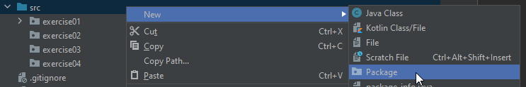

# EPR-WIN (Prof. Schneider/Prof. Eiglsperger), Blatt 02

Abgabetermin der Hausaufgaben: 02. April in der Übung

## Anmerkungen

- Verwenden Sie bitte jeweils einen sinnvollen Variablennamen.
- Variablennamen *müssen* den [Namenskonventionen](https://bwsyncandshare.kit.edu/s/xqek5T4cR533PEo) entsprechen.

## Aufgabe 2.1 - Präsenzaufgabe

Stellen Sie sicher, dass Sie im Hochschulnetz oder VPN sind.

Öffnen Sie das Web-Interface für Ihr Team-Projekt im
Browser: `https://git.in.htwg-konstanz.de/eiglsperger/2026s-epr/teams/NAME`, wobei Sie
NAME durch Ihren Team-Namen ersetzen, also
z.B. `https://git.in.htwg-konstanz.de/eiglsperger/2026s-epr/teams/Area`. Wenn Sie hier
einen Zugriffsfehler erhalten, machen Sie bitte nicht weiter, sondern wenden
sich an jemanden von der Übungsleitung.

Wiederholen Sie die Schritte aus Blatt 1 Aufgabe 1.3, um Ihr Team-Projekt zu klonen,
verwenden dazu aber die URL

```text
git@git.in.htwg-konstanz.de:eiglsperger/2026s-epr/teams/NAME.git
```

wobei Sie wieder NAME durch ihren Team-Namen ersetzen. Das .git am Ende ist
wichtig!

**Aufgepasst:** Als Ziel verwenden Sie einen Ordner **neben** dem
Material-Ordner, so dass am Ende (mindestens) zwei Unterordner in Ihrem
`EPR`-Ordner sind. Einmal `material`, einmal `NAME` (Teamname).
Diese beiden Ordner müssen sich **nebeneinander** befinden:

```text
└───EPR
    ├───Team-Order (z.B. Area)
    └───material
```

Ein **häufiger Fehler** ist, dass sich zwei IntelliJ-Projekt im selben oder in
Unterordnern befinden. Damit kommt IntelliJ nicht zurecht und Sie müssen alle
Projekte noch einmal neu anlegen, wenn Ihnen das passiert.

Sie können das Team-Projekt nun in IntelliJ öffnen. Das geht über den
Open-Button oder über File->Open. Wenn Sie das material-Projekt noch geöffnet
haben, wählen Sie "New Window", damit sich ein zweites IntelliJ-Fenster öffnet
und Sie mit beiden Projekten parallel arbeiten können.

Öffnen Sie die Java-Klasse "HelloStudents" und führen Sie das Programm aus.
Passen
Sie die Ausgabe an. Sie können innerhalb der Anführungszeichen beliebigen Text
eingeben, auch Emojis 😎 (Windows-Taste plus Punkt öffnet die Emoji-Tastatur).
Dieser erscheint dann auf der Konsole, wenn Sie das Programm ausführen.

## Aufgabe 2.2 - Präsenzaufgabe

a) Erstellen Sie durch: Rechtsklick auf den src-Ordner -> New -> Package, ein
neues Package und nennen es `exercise02_NAME`, wobei `NAME` durch den Vornamen ohne Umlaute und Sonderzeichen ersetzt
wird, z.B. `exercise2_markus`.



Erstellen Sie eine .java Datei `Variablen.java` in dem Package `exercise02_NAME` für
Lösungen dieser Aufgabe.

**Tipp:** Mit Rechtsklick auf das Package -> New -> File ->

Erstellen Sie den Rumpf des Programms durch Eingabe folgender Zeilen:

```
void main() {

}
```

Deklarieren Sie nun Variablen passender Typen und weisen Sie
jeweils sinnvolle Werte zu

a) wie viele Studierende WIN-EPR belegen,

b) wie viele Studierende an der HTWG eingeschrieben sind,

c) wie viele Menschen in der Europäischen Union leben,

d) wie viele Menschen auf der Erde leben,

e) welche Durchschnittsnote in der Klausur erreicht wurde.

## Aufgabe 2.3 - Präsenzaufgabe

Im Einzelhandel spricht man von der **absoluten Handelsspanne** als Differenz zwischen Verkaufspreis und Einkaufspreis.
Nehmen Sie an, dass sowohl der Verkaufspreis als auch der Einkaufspreis in Euro gegeben sind und keine Cent-Beträge
enthalten, sondern nur Euro.
Erstellen Sie analog zu Aufgabe 2.2 ein Java-Programm, geben Sie dem Java-Programm den Namen `Handel.java`.

a) Welche Eingabewerte sind notwendig die um absolute Handelsspanne zu berechnen?
Welche Typen verwenden Sie?
Definieren Sie in Java Variablen, die die Eingaben aus a) mit sinnvollen Werten für ein Kleidungsstück belegen.

b) Implementieren Sie mit Java die Formeln für absolute Handelsspanne und berechnen Sie
das Ergebnis für die angegebenen Beispielwerte aus b).

c) Geben Sie alle Variablen auf der Konsole (`System.out.println();`) mit einem sinnvollen Text aus.

d) Führen Sie Punke a)-c) auch für die **relative Handelsspanne** aus. Die relative Handelsspanne ist
der prozentuale Anteil der Differenz zwischen Verkaufs- und Einkaufspreis am Verkaufspreis eines Produkts.

## Aufgabe 2.4 - Hausaufgabe (4 Punkte)

Berechnen Sie den Preis für eine Warensendung aus 2 Artikeln in der Fremdwährung Dänische Kronen.
Dabei sind die Preise für beide Artikel als Nettopreise in Euro gegeben und für den
ersten Artikel müssen Sie noch den Regelsatz von 19% anwenden, für den zweiten den ermäßigten Satz von 7%.
Es fallen Versandkosten von 4.99 Euro an.
Erstellen Sie analog zu Aufgabe 2.2 ein Java-Programm, geben Sie dem Java-Programm den Namen `Warensendung.java`.

a) Was sind die Eingabewerte? Was die Ausgabewerte?

b) Definieren Sie in Java Variablen, die die Eingaben aus a) belegen, für Werte die nicht gegeben sind verwenden Sie
sinnvolle Werte.

c) Implementieren Sie mit Java die Formeln für die Preisberechnung der Warensendung und berechnen Sie
das Ergebnis für die angegebenen Beispielwerte aus b).

d) Geben Sie alle Variablen auf der Konsole (`System.out.println();`) mit einem sinnvollen Text aus.
