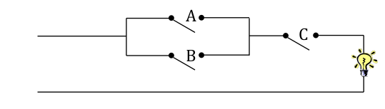

# EPR-WIN (Prof. Schneider/Prof. Eiglsperger), Blatt 03

Abgabetermin der Hausaufgaben: 9. April 2026 in der Übung

## Aufgabe 3.1 - Präsenzaufgabe

Erstellen Sie ein Java-Programm `HandelVerbessert.java`,
welches die Implementierung der Berechnung aus Aufgabe 2.3 von Blatt 2 übernimmt.
Die Ausgabe auf der Konsole soll dabei mittels `printf` durch Runden auf 2 Nachkommastellen verbessert werden.

## Aufgabe 3.2 - Präsenzaufgabe

Implementieren Sie folgenden Schaltkreis in einem Java Programm `Schaltkreis.java`:



a) Legen Sie boolsche Variablen `schalterA`, `schalterB`, `schalterC` an, die Sie initial alle auf `false` setzen.

b) Nun sollen Sie in einer weiteren boolschen Variable `lichtBrennt` berechnen, ob das Licht brennt, indem Sie
`schalterA`, `schalterB`, `schalterC` mithilfe boolscher Operatoren miteinander verknüpfen.

c) Geben Sie den Wert der Variable `lichtBrennt` mit folgendem Code auf der Konsole aus:

```
System.out.println("Licht brennt: " + lichtBrennt);
```

d) Finden Sie eine Belegung für die Variablen `schalterA`, `schalterB`, `schalterC` bei welcher die Berechnung `true`
ergibt.

e) Verbessern Sie die Ausgabe des Programms. Für den Fall, dass das Licht brennt soll "Das Licht brennt" ausgegeben
werden,
und im anderen Fall "Das Licht ist aus". Testen Sie beide Fälle.

## Aufgabe 3.3 - Präsenzaufgabe

Schreiben Sie ein Java-Programm `Heizung.java`, welches entscheidet, ob der Austausch einer Heizung förderfähig ist.
Der Austausch einer Heizung ist förderfähig, wenn die Heizung älter als 20 Jahre ist oder wenn es sich um eine Ölheizung
handelt.
Wenn die Heizung förderfähig ist, soll der Text "Die Heizung ist förderfähig" ausgegeben werden ansonsten der Text "Die
Heizung ist nicht förderfähig".

a) Berücksichtigen Sie zuerst nur den Parameter Ölheizung. Fragen Sie den/die Benutzer*in, ob es sich um eine Ölheizung
handelt.
Verwenden Sie `Scanner` um die Eingabewerte von der Konsole einzulesen.
Die Eingabe soll entweder `J` oder `N` sein. Entsprechend der Eingabe soll der in der Aufgabenstellung genannte Text
ausgegeben werden.

b) Erweitern Sie nun die Logik des Programms um die Eingabe des Alters der Heizung.
Diese soll aber nur eingegeben werden, wenn es sich nicht um eine Ölheizung handelt.
Implementieren Sie die Entscheidungslogik und geben Sie das Ergebnis auf der Konsole aus.

## Aufgabe 3.4 - Hausaufgabe (3 Punkte)

Schreiben Sie ein Java-Programm `Olympia.java`, welches entscheidet, ob in einem Jahr
olympische Sommerspiele stattgefunden haben.
Das Jahr soll dabei von der Konsole eingelesen werden.
Recherchieren Sie zuerst im Internet, wann die Spiele tatsächlich stattgefunden haben,
und leiten Sie daraus ein möglichst einfaches Program ab.

## Aufgabe 3.5 - Hausaufgabe (4 Punkte)

Schreiben Sie ein Programm `Namenschild.java` welches ein Namensschild erzeugt.

Beispiel:

```
Max MUSTERMANN
- Consultant -
```

Es sollen also Vorname, Nachname und Beruf eingelesen werden,
und die Ausgabe soll dann im obigen Format erscheinen.

a) Erzeugen Sie Variablen für die Eingabewerte und lesen diese von der Konsole mittels `Scanner` ein.

b) Implementieren Sie die Ausgabe ohne ``printf`` zu verwenden.

c) Implementieren Sie die Ausgabe mit nur einem Aufruf zu ``printf``.


