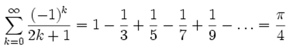

# EPR-WIN (Prof. Schneider/Prof. Eiglsperger), Blatt 04

Abgabetermin der Hausaufgaben: 16. April in der Übung

## Aufgabe 4.1 - Präsenzaufgabe

Gegeben ist folgende for-Schleife:

```
for (int id = 10; id > 0; id -= 2) {
    System.out.println(id);
}
```

Programmieren Sie eine while-Schleife und eine do-while-Schleife, die dieselbe
Ausgabe erzeugen. Überprüfen Sie, dass alle Ihre Schleifen dieselbe Ausgabe
erzeugen.

## Aufgabe 4.2 - Präsenzaufgabe

Schreiben Sie ein Java-Programm, welches die Anzahl des Buchstabens "e" in einem String zählt.

a) Überlegen Sie sich 3 Testfälle für das Programm und schreiben diese auf.
Dabei sollen möglichst unterschiedliche Eingaben verwendet werden.

b) Definieren Sie eine Variable für die Eingabe und eine Variable für das Ergebnis.
Welche Typen haben diese Variable?

c) Implementieren Sie die Logik für das Zählen. Testen Sie das Programm mit dem Debugger.

d)    Erweitern Sie das Programm so, dass der Eingabestring von der Konsole eingelesen wird
und auch das Ergebnis auf der Konsole ausgegeben wird.

## Aufgabe 4.3 - Präsenzaufgabe

Lösen Sie die Aufgaben 4.1 und 4.2 auf einem Blatt Papier, oder auf einem Schreibprogramm im Tablet.

* Versuchen Sie die Aufgabe möglichst ohne Hilfsmittel zu lösen,
  benutzen Sie dazu nicht die Lösung, die Sie am Rechner erstellt haben.
* Wenn Sie nicht weiterkommen, benutzen Sie zuerst die Vorlesungsunterlagen.
* Wenn Sie dann immer noch nicht weiterkommen, schauen Sie sich ihre Lösung am Rechner an,
  schließen diese aber wieder, bevor Sie mit dem Schreiben beginnen.
* Wiederholen Sie diesen Vorgang, bis Sie die Aufgabe vollständig ohne Hilfsmittel lösen können.
  Lassen Sie etwas Zeit zwischen den Versuchen, um den Lerneffekt zu erhöhen.

## Aufgabe 4.4 - Hausaufgabe (4 Punkte)

Verallgemeinern Sie das Programm aus Aufgabe 4.2 so, dass die Anzahl eines *beliebigen* Zeichens gezählt wird.
Das Zeichen soll auch vom Benutzer über die Konsole eingegeben werden können.

a) Überlegen Sie sich 3 Testfälle für das Programm und schreiben diese auf.
Dabei sollen möglichst unterschiedliche Eingaben verwendet werden.

b) Definieren Sie Variablen für die Eingabe und eine Variable für das Ergebnis.
Implementieren Sie anschließend die Programmlogik.

c)    Erweitern Sie das Programm so, dass der Eingabestring von der Konsole eingelesen wird
und auch das Ergebnis auf der Konsole ausgegeben wird. Testen Sie das Programm mit den Testfällen aus a).

## Aufgabe 4.5- Hausaufgabe (6 Punkte)

Schreiben Sie ein Programm `HatUmlaute`, welches ausgibt, ob in einer eingegebenen Zeichenkette Umlaute
(ä, ü, ö, jeweils groß oder klein) vorkommen.

a) Überlegen Sie sich 3 Testfälle für das Programm und schreiben diese auf.
Dabei sollen möglichst unterschiedliche Eingaben verwendet werden.

b) Definieren Sie Variablen für die Eingabe und eine Variable für das Ergebnis.
Implementieren Sie anschließend die Programmlogik.

c)    Erweitern Sie das Programm so, dass der Eingabestring von der Konsole eingelesen wird
und auch das Ergebnis auf der Konsole ausgegeben wird. Testen Sie das Programm mit den Testfällen aus a).

## Aufgabe 4.6 - Bonusaufgabe (Pi)

a) Schreiben Sie eine Methode, welche π berechnet. Verwenden Sie dazu folgende
Berechnungsvorschrift ([Leibniz-Reihe](https://de.wikipedia.org/wiki/Leibniz-Reihe)):



**Tipp:** Sie müssen die Anzahl der zu berechnenden Glieder (*k*)
der Reihe begrenzen.