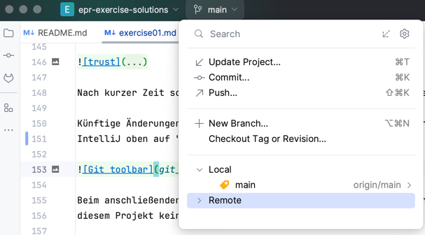
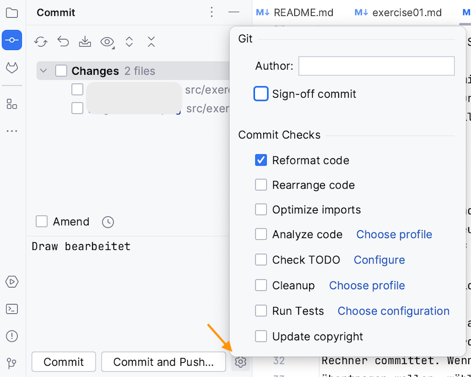
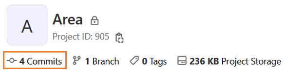

# EPR-WIN (Prof. Schneider/Prof. Eiglsperger), Blatt 05

## Aufgabe 5.1 - Präsenzaufgabe    (Variablen) [8 Punkte]

Deklarieren Sie in Java Variablen, die folgende Daten speichern und initialisieren Sie diese mit einem Beispielwert:

* Breite eines Tisches in cm,
* Name eines Schiffs,
* Anzahl der Stockwerke eines Hauses,
* ob eine Person volljährig ist.

## Aufgabe 5.2:    (Verzweigungen) [8 Punkte]

Ergänzen Sie die Implementierung des folgenden Java-Programms.
Das Programm entscheidet, ob ein Auto zum Service muss. Geben Sie in diesem Fall `Service` auf der Konsole aus.
Falls kein Service notwendig ist, geben Sie `Kein Service` auf der Konsole aus.
Ein Service ist notwendig, wenn

* mindestens 12 Monate vergangen sind UND mehr als 10000 km gefahren wurden, ODER
* wenn mehr als 24 Monate vergangen sind.
  Lesen Sie dabei die Eingabewerte von der Konsole mittels Scanner ein.

```
void main() {

}
```

## Aufgabe 5.3:    Präsenzaufgabe (Schleifen) [2 + 3 + 3 = 8 Punkte]

a) Gegeben ist folgende for-Schleife. Welche Ausgabe erzeugt die Schleife auf der Konsole?

```
for (int id = 5; id < 15; id += 3) {
System.out.print(id + ",");
}
```

b) Programmieren Sie eine while-Schleife, die dieselbe Ausgabe wie die for-Schleife aus der Aufgabe a) erzeugt.

## Aufgabe 5.4:    Präsenzaufgabe (Schleifen) [5 Punkte]

Gegeben ist folgendes Java-Programm:

```
String eingabe = ________________;
boolean found = false;
int i = 0;
while (!found && i < eingabe.length()) {
    char c = eingabe.charAt(i); 
    if (c == '.') {
        found = true;
    } else {
        System.out.println(c);
    }
    i++;
} 
```

a) Welche Ausgabe erzeugt das Programm für die Eingabe "Erster Satz. Zweiter Satz."
b) Welche Ausgabe erzeugt das Programm für die Eingabe "Hallo Welt!"
c) Welche Ausgabe erzeugt das Programm für einen beliebigen Wert für `eingabe`?

## Aufgabe 5.5:    Präsenzaufgabe (Berechnung und Verzweigung)  [10 Punkte]

Die Kosten für eine Lieferung bei einem Pizza-Service berechnen sich
aus den Eingabewerten **Entfernung** und **Pauschale**.
Dabei wird die Entfernung in ganzen Kilometern angegeben und die Pauschale in Euro angegeben.
Verwenden Sie geeignete Datentypen.
Die Kosten betragen:

* für Lieferungen unter 20 km: **Entfernung** multipliziert mit 40 Cent pro Kilometer plus **Pauschale**,
* für Lieferungen ab 20 km: **Entfernung** multipliziert mit 45 Cent.
  Ergänzen Sie folgendes Java-Programm, welches die Lieferkosten berechnet.
  Geben Sie das Ergebnis mittels `printf` aus, formatieren Sie dabei das Ergebnis auf zwei Nachkommastellen.
  Ergänzen Sie das folgende Java-Programm, sodass die Lieferkosten berechnet werden.

```
void main() {

   ____ entfernung = __________;
   ____ pauschale = __________;
   
   
     

}
```

## Aufgabe 5.6 - Hausaufgabe (Git Commit und Push)

a) Einigen Sie sich, welches Team-Mitglied die Aufgaben hochlädt.
Diese Änderung werden nun committet: Dazu klicken Sie oben auf "main" und wählen dann commit:



Im Dialog links geben Sie eine kurze Beschreibung an, z.B. "Aufgaben hochladen".

Bei diesem ersten Commit konfigurieren Sie bitte noch folgendes (müssen Sie pro
Projekt und Rechner nur einmal tun), indem Sie auf das Zahnrad im Commit-Dialog
klicken und sicherstellen, dass nur das Häkchen bei Reformat Code angewählt
ist (und kein anderes):



Wählen Sie anschließend "Commit and Push". Commit bedeutet, dass die Änderungen
bei Ihnen lokal als neue Version hinzugefügt wird. Push bedeutet, dass Ihr
lokaler Stand auch auf den GitLab-Server übertragen wird.

Bei dem Dialog, der sich öffnet, klicken Sie einfach auf "Push".

**Tipp**: Sollten Sie aus Versehen (oder auch beabsichtigt) nur auf Commit
geklickt haben, so werden die Änderungen nur in Ihr lokales Repo auf Ihrem
Rechner committet. Wenn Sie die Änderungen anschließend auch auf den Server
übertragen wollen, wählen Sie "Push" aus dem Menü hinter "main" oben, um
die Änderung zu "pushen":


b) Öffnen Sie Ihr GitLab-Repository im Browser und sehen nach, ob die Änderungen
dort angekommen sind. Sie finden es unter der
URL `https://git.in.htwg-konstanz.de/eiglsperger/2026s-epr/teams/NAME`, wobei Sie NAME
durch Ihren Team-Namen ersetzen. Wenn Sie oben auf "x Commits" klicken, sehen
Sie alle Änderungen an dem Projekt (bei Ihnen steht hier eventuell eine andere
Zahl als die 4.):



## Aufgabe 5.7 - Hausaufgabe (Git Pull)

Die andere Person, die nicht committet hat, clont das Team Projekt erneut in ein
neues Verzeichnis und arbeitet von nun an in diesem neuen Projekt.
Behalten Sie das alte Projekt bei, um Ihre alten Lösungen zu behalten.
Ab jetzt arbeiten Sie in diesem neuen Projekt.
Sie können immer noch beide separate Lösungen im Projekt verwenden.
Sie müssen nur darauf achten, nicht diesselben Dateinamen zu verwenden.

Um Änderungen des Teampartners herunterzuladen, wählen Sie "Update Project" aus dem Menü hinter Main oben:


Im sich öffnenden Dialog klicken Sie auf Ok. Jetzt sollten auch Sie die
Änderungen bei sich auf dem Rechner haben.


