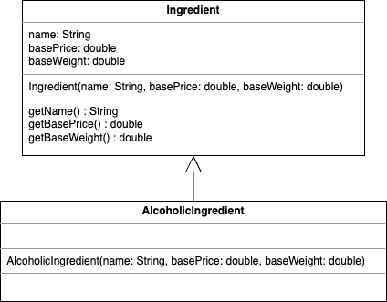
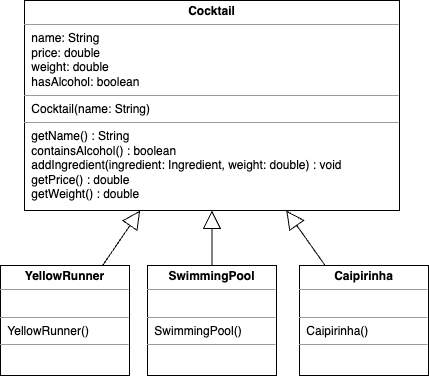

# EPR-WIN (Prof. Schneider), Blatt 12

## Hinweis

Beachten Sie
die [Java-Naming-Konventionen](https://bwsyncandshare.kit.edu/s/xqek5T4cR533PEo)!
Bitte erstellen Sie für jedes Aufgabenblatt ein package (`exercise11`, etc.) und
darin für jede Aufgabe eine Klasse und geben dieser ihr einen geeigneten Namen.

## Präsenzaufgabe 12.1

In dieser Aufgabe geht es darum, eine Cocktail-Bar nachzustellen. Suchen Sie
deshalb jeweils ein Rezept für die folgenden Cocktails: Caipirinha, Swimming
Pool, Yellow Runner. Recherchieren Sie außerdem, was die jeweiligen Zutaten
kosten. Beispiel: Für ein Glas Caipirinha braucht man 60ml (6cl) Cachaca. Eine
Flasche Pitú Cachaca mit 700ml Inhalt kostet 10,80€. Außerdem braucht man eine
Limette (Gewicht 50g). 500g Limetten kosten 4,99€. Und so weiter... Verwenden
Sie für `baseWeight` die Einheiten Milliliter (ml) bzw. Gramm (g)
unter der (vereinfachenden) Annahme, dass 1ml genau 1g wiegt.

a) Modellieren Sie zwei Klassen `Ingredient` und `AlcoholicIngredient`.
`AlcoholicIngredient` erbt von `Ingredient`:



In der Darstellung sehen Sie Attribute, Konstruktor und Methoden der Klassen.
Wählen Sie sinnvolle Zugriffsmodifikatoren (public, private, ...).

b) Legen Sie eine Klasse Main an mit einer `main`-Methode, in der Sie die
Zutaten Cachaca (`AlcoholicIngredient`) und Limette (`Ingredient`)
instanziieren und jeweils `name`, `basePrice` und `baseWeight` ausgeben
(benutzen Sie zum Zugriff die get*-Methoden!)

c) Betrachten Sie in folgendem Bild zunächst die Klasse `Cocktail`:



Legen Sie die Klasse `Cocktail` an mit allen Attributen, dem
Konstruktor (name als Argument) und den Methoden an. Die get-Methoden und
containsAlcohol liefern einfach die entsprechenden Attribute zurück. Die Methode

``
void addIngredient(Ingredient ingredient, double weight) { }
``

lassen Sie zunächst leer. Wählen Sie sinnvolle Zugriffsmodifikatoren (public,
private).

d) Legen Sie nun die drei Cocktail-Rezepte als Klassen `YellowRunner`,
`SwimmingPool`, `Caipirinha` an. Die Klassen bestehen nur aus dem Konstruktor,
der über `addIngredient` die entsprechenden Zutaten hinzufügt. Hier als Beispiel
ein weiterer Cocktail:

```
public class WhiteRussian extends Cocktail {

    public WhiteRussian() {
        super("White Russian");

        // 20ml Wodka, der 12€ pro 700ml kostet
        addIngredient(new AlcoholicIngredient("Wodka", 12, 700), 20);

        // 30ml Kahlua, der 15€ pro 500ml kostet
        addIngredient(new AlcoholicIngredient("Kahlua", 15, 500),30);

        // 50ml Sahne, die 2€ pro 250ml kostet
        addIngredient(new Ingredient("Sahne", 2, 250), 50);
    }
}
```

Beachten Sie, dass das `baseWeight` und `weight` immer der Wert in ml oder g
ist.

e) Implementieren Sie nun in der Klasse `Cocktail` die Methode

```
void addIngredient(Ingredient ingredient, double weight)
```

Wenn es sich bei dem Ingredient-Argument um eine Instanz
von `AlcoholicIngredient`
handelt (🡪 `instanceof`-Operator!), so setzen Sie `hasAlcohol` auf `true`.
Außerdem updaten Sie die Werte von `price` und `weight`. Für `price` müssen Sie
über den Basispreis und -gewicht umrechnen. Bei Gewicht können Sie
einfach `weight`
aufaddieren. Der Einfachheit halber nehmen wir an, dass 1ml genau 1g wiegt.

f) Fügen Sie Ihrer main-Methode weiteren Code hinzu, der jeweils eine Instanz
der Getränke anlegt und die Werte von `getName()`, `getPrice()`, `getWeight()`
und `containsAlcohol()` ausgibt.

g) Wie können Sie erreichen, dass man nach wie vor von den konkreten
Klassen `YellowRunner`, `SwimmingPool` und `Caipirinha` eine Instanz
erzeugen kann, nicht jedoch von der allgemeinen
Oberklasse `Cocktail`?

## Hausaufgabe 12.2

a) Erstellen Sie eine `Analyse` Klasse mit main-Methode, die den folgenden Code enthält.

```
Scanner inputScanner = new Scanner(System.in)
                   .useDelimiter("\n");
String fileName = "";

System.out.print("Enter filename: ");
fileName = inputScanner.nextLine();

Path path = Paths.get(fileName);
Scanner fileScanner = new Scanner(path, "UTF-8")
       .useDelimiter("\n");

System.out.println("\nFile content: ");
while (fileScanner.hasNextLine()) {
   System.out.println(fileScanner.nextLine());
}
fileScanner.close();

```

Importieren Sie die nötigen Packages.

Wie Ihnen Ihre IDE anzeigt, wirft die Zeile mit
`fileScanner = new Scanner(...);` eine `IOException`. Behandeln Sie diese
Exception mit try-catch. Wenn die Exception fliegt, sollen Sie den Rückgabewert
von
`getMessage()` der Exception ausgeben und den Benutzer/die Benutzerin zur
erneuten Eingabe eines Dateinamens auffordern.

Testen Sie das Programm,

1. mit einer Datei `verkauf.txt` im Hauptverzeichnis Ihres Projekts, deren
   Inhalt (mehrere Zeilen) das Programm ausgeben soll.
2. mit dem Dateinamen einer Datei, die nicht existiert.

b) Die Datei `verkauf.txt` enthält den Verkauf der Cocktail-Bar.
Jede Zeile enthält genau einen Buchstaben für ein verkauftes Getränk:
`Y` für `YellowRunner` (7 Euro),`S` für `SwimmingPool` (8 Euro) und `C`für `Caipirinha` (7,50 Euro).
Benutzen Sie eine Switch-Anweisung um, anstelle des Buchstabens, den Namen des Getränkes auszugeben.

c) Falls ein unbekannter Buchstabe in einer Zeile vorkommt, soll eine `IllegalArgumentException` geworfen werden und die
Verarbeitung der Datei eingestellt werden.
Testen Sie dies mit der Datei`fehler.txt`

d) Berechnen Sie den Gesamtumsatz aus der Datei `verkauf.txt` und geben Sie ihn aus.